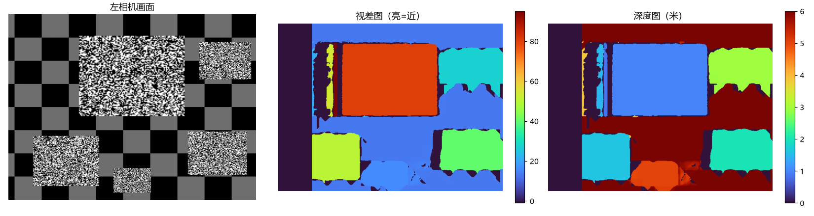

### 双目视觉测距（stereo-vision-depth）

这个项目用的不是真实摄像头，而是**代码合成**的双目画面（这样答案已知，可以验证算法算得准不准）。

#### 运行效果

运行完会打印每个物体的"真实距离和实测距离"：

| 物体 | 真值(m) | 实测(m) | 误差(cm) | 视差(px) |
| --- | --- | --- | --- | --- |
| 近处正方体 | 1.00 | 1.00 | 0.03 | 80.0 |
| 左前方块 | 1.60 | 1.60 | 0.05 | 50.0 |
| 右下方块 | 2.00 | 2.00 | 0.06 | 40.0 |
| 右上远物 | 3.00 | 2.97 | 3.10 | 26.9 |
| 最远长条 | 5.00 | 5.00 | 0.15 | 16.0 |

结果图：



可以看到：**越近的物体视差越大，误差也越小**，这和双目测距的理论一致。

#### 项目流程

```
合成棋盘格照片 → 单目标定 → 双目标定(求基线) → 极线校正
→ 合成带"真值深度"的场景 → SGBM 算视差 → 算深度 → 和真值对比
```

#### 环境要求

- Python 3.10 ~ 3.13（**不要用 3.14**，目前 OpenCV 还没有 3.14 的安装包，会装不上）
- Windows / macOS / Linux 

#### 安装和运行

1. 下载本项目，打开终端进入项目文件夹：

```bash
cd stereo-vision-depth
```

2. 安装依赖：

```bash
pip install -r requirements.txt
```

3. 运行：

```bash
python stereo_demo.py
```

4. 打开 `images/` 文件夹查看生成的结果图。

#### 原理

```
距离 Z = 焦距 f × 基线 B / 视差 d
```

- 焦距 f：相机的内参（标定得到）
- 基线 B：两个摄像头之间的距离
- 视差 d：同一个点在左右两张图里的位置差（像素）

**物体越近 → 视差越大 → 距离越小。**

#### 项目结构

```
stereo-vision-depth/
├── stereo_demo.py    # 主程序（所有流程都在这一个文件里）
├── requirements.txt  # 依赖列表
├── README.md
└── images/           # 运行后生成的结果图
```

#### 常见问题

**Q：为什么不用真实摄像头？**
答：真实摄像头需要先买双目模组、拍棋盘格标定，新手门槛高。用合成数据可以把"测距算法"这部分先练熟，理解了原理再上真实设备会轻松很多。

#### 说明

- 数据是程序合成的，所以测出来的误差非常小；真实摄像头会有畸变、噪声，误差会比这个大得多。
